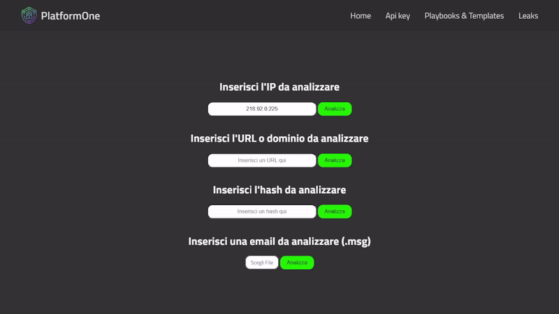

# PlatformOne

Questo progetto è un'applicazione web che permette di analizzare ed ottenere il report per url, hash ed email.

## Funzionalità
- Report delle URL tramite API verso Virustotal e se la URL ha come verdetto malware dal vendor Fortient, viene mostrato lo screenshot tramite chiamata API a Urlscan.io.
- Report degli hash tramite API verso Virustotal, FileScan.io, Hybrid Analysis e MalwareBazaar.
- Estrazione di informazioni dalle intestazioni delle email (mittente, destinatario, cc, oggetto).
- Analisi del corpo del messaggio per identificare URL e allegati.
- Verifica degli URL tramite API di terze parti per determinare se sono considerati malevole.

##### Esempio di report per IP, URL/Dominio e hash

## Utilizzo

- Dopo aver avviato l'applicazione, visita `http://localhost:5000` nel tuo browser.
- Inserire la URL, l'hash o l'email da analizzare
- La pagina mostrerà un report dettagliato con i risultati e verdetti.

